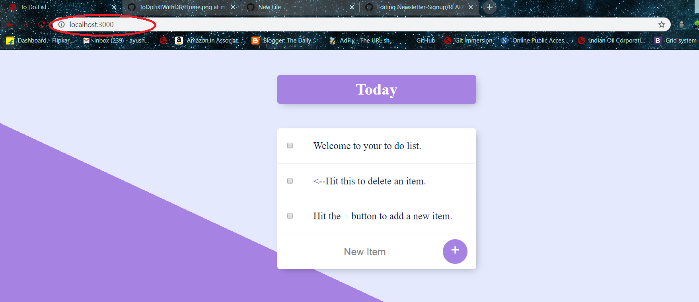
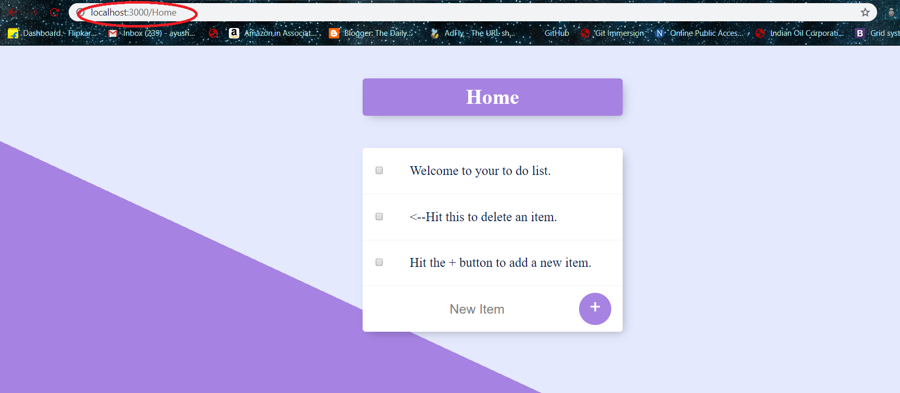

# ToDoListWithDB
This is an updated version of the To do list,having a database(MongoDB) and moreover it has many functionalities like ability to delete the provided data(though that's a simple thing) and moreover you can infinite number of routes by just adding a "/&lt;customListName>" to the url.

 #Main Page
 

#Sample Home Route Page

